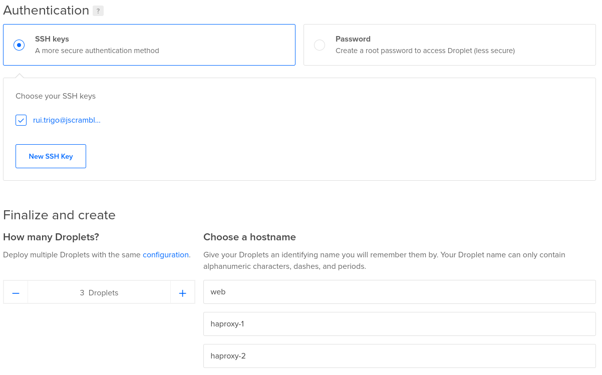
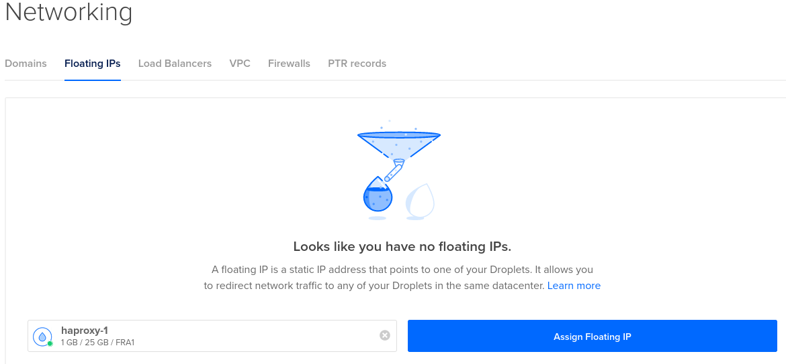

:scales: :scales: :up:

## Prologue
In previous posts we have been writing about high availability on databases, like [MongoDB][1] and [PostgreSQL][2].

So, if we have a load balancer forwarding web requests to an application which accesses a highly available database is more resilient than a vulnerable single instance database. Okay. And if your load balancer stops working, that HA database might still store your data safely, but can't get your clients to reach it.

That's why we are now about to learn how to build a highly available load balancer chain with [HAProxy][3] and [keepalived][4] on DigitalOcean, with the help of Floating IP.

## Objectives
- create and assign a **Digital Ocean Floating IP** (aka FLIP) to our current primary load balancer node;
- setting up an **Apache** web server with several virtual servers
- configure 2 **HAProxy** nodes (master and backup) ready to serve the Apache sites
- add **keepalived** to watch **HAProxy** process and establish high availability
- make **keepalived** interact with **Digital Ocean CLI** to reassign FLIP to new primary node on promotions;
- keep this switchover transparent to the **Apache** clients, so the whole system works without human help.

## Prerequisites
- a **Digital Ocean** account and API token ([create an account using my referral to get free credits][5])

## Set up your cluster

### Create your droplets


Create 3 droplets, preferably with the Ubuntu 20.04 operating system:
- web (Apache server)
- haproxy-1 (master HAProxy)
- haproxy-2 (backup HAProxy)

To make configurations run smoother, add your public SSH key when creating the droplets. You can also use the key pair I provided on [GitHub][12] for testing purposes.

>If you'd like to only use 2 droplets, you can ignore the third node as it will be a PostgreSQL witness.

*Note: If you use an SSH private key which is shared publicly on the internet, your cluster can get hacked.*



### Assign a floating IP to your primary node



Create a floating IP address and assign it to your primary node (haproxy-1).

### Setup Apache server
- load balancing to different servers
- they represent different web application servers
- simple response

### Install HAProxy
- straightforward

**Ports**
node.vm.network "forwarded_port", guest: 80, host: "800#{i}"
node.vm.network "forwarded_port", guest: 1936, host: "810#{i}}"

```bash
apt-get update
apt-get install -y haproxy keepalived
cp /vagrant/configs/haproxy.cfg /etc/haproxy/
cp /vagrant/configs/rsyslog.conf /etc/
mkdir -p /opt/scripts
cp /vagrant/scripts/reassign-hcloud-flip.sh /opt/scripts/
chmod u+x /opt/scripts/reassign-hcloud-flip.sh
service rsyslog restart
service haproxy restart
if [ $(hostname) == "haproxy-1" ]; then
  cp /vagrant/configs/keepalived_master.conf /etc/keepalived/keepalived.conf
else
  cp /vagrant/configs/keepalived_backup.conf /etc/keepalived/keepalived.conf
fi
service keepalived restart
```

### Install keepalived
- watch haproxy PID
- promotion script
- alerting places

```bash
apt-get update
apt-get install -y apache2
a2enmod headers
a2dissite 000-default
cd /vagrant/configs
for x in site-*.conf; do
  cp ${x} /etc/apache2/sites-available
  a2ensite ${x%.*}
done
cp site-*.conf /etc/apache2/sites-available
cp ports.conf /etc/apache2/
cp apache2.conf /etc/apache2
service apache2 restart
touch /var/www/html/haproxy_check
```

## Primary failure test
- stop haproxy on haproxy-1
- test Apache site

## Reverting the promotion
- fix haproxy-1
- stop keepalived on haproxy-2

## Conclusion
- vagrant file for GitHub
- if there is no load balancer available, it does not matter how many application and database servers you have to handle the load

[You can find the source code in this post on GitHub][99].

[1]: https://blog.jscrambler.com/how-to-achieve-mongo-replication-on-docker/
[2]: https://blog.jscrambler.com/how-to-automate-postgresql-and-repmgr-on-vagrant/
[3]: http://www.haproxy.org/
[4]: https://keepalived.org/
[5]: https://m.do.co/c/00ac35d4c268
[99]: https://github.com/r-trigo
